KISS-UI Screenshots
-------------------

Below are screenshots of the KISS-UI examples, on Windows 7 with Visual Styles enabled (see the README for more info), and on Linux Mint using the [Nightlife - Mint][nightlife-mint] theme.

We at KISS-UI aren't exactly designers, so feel free to let us know how we can make these better aesthetically.

[nightlife-mint]: http://cinnamon-spices.linuxmint.com/themes/view/31

###`examples/button_test.rs`

This shows the main example as well as the dialogs that pop up when the "Message" and "Alert" buttons are clicked, respectively.

####Windows
Not sure why the borders are cut off on the other dialogs.

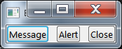 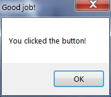 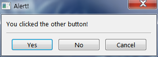

####GTK+
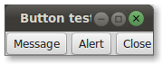 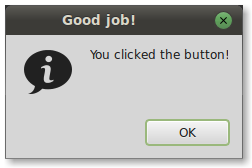 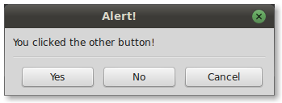

###`examples/progress_test.rs`
**Note**: the dashed version of the progress bar isn't always distinguished. It depends on the platform and visual theme being used.

####Windows

####GTK+
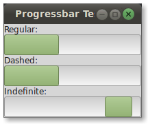

###`examples/show_image.rs`
This needs a better image-generating function. Suggestions and/or PRs are very welcome.

#####Note: resized to fit the page better.

####Windows
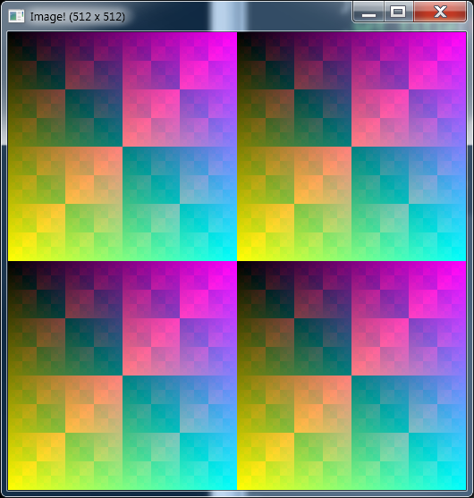

####GTK+
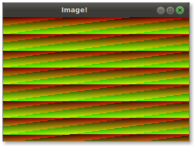

###`examples/textbox_test.rs`
This example shows the main dialog as well as the one that pops up when the "Save" button is clicked.

####Windows
Notice the very faint drop-shadow around the right dialog, which is the currently focused one. This screencap was taken by selecting screen area instead of a specific window like the others.

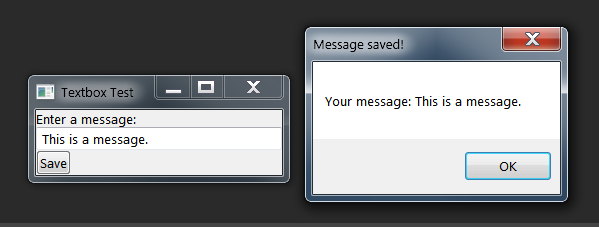

####GTK+
The same was done in Linux.

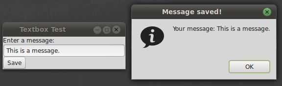

###`examples/window_test.rs`

#####Note: resized to fit the page better.

####Windows
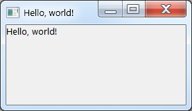

####GTK+
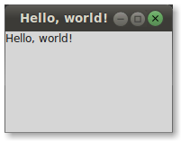

